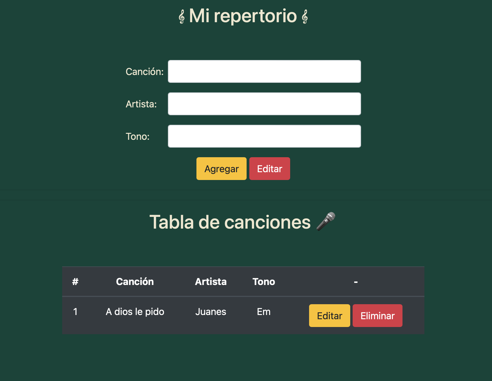
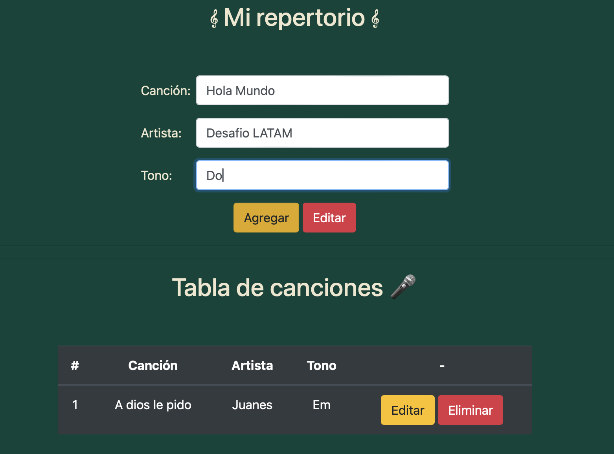
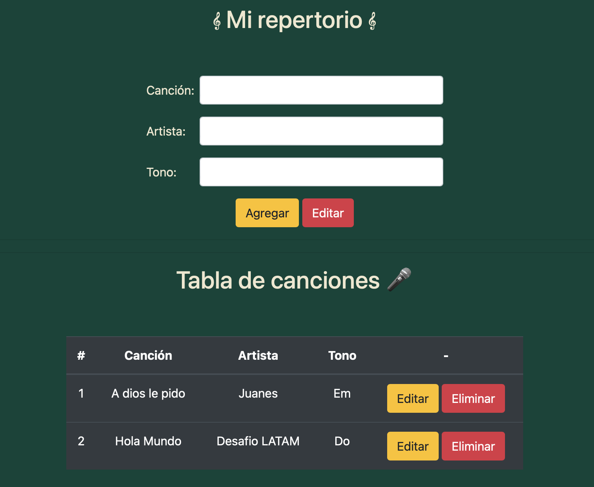
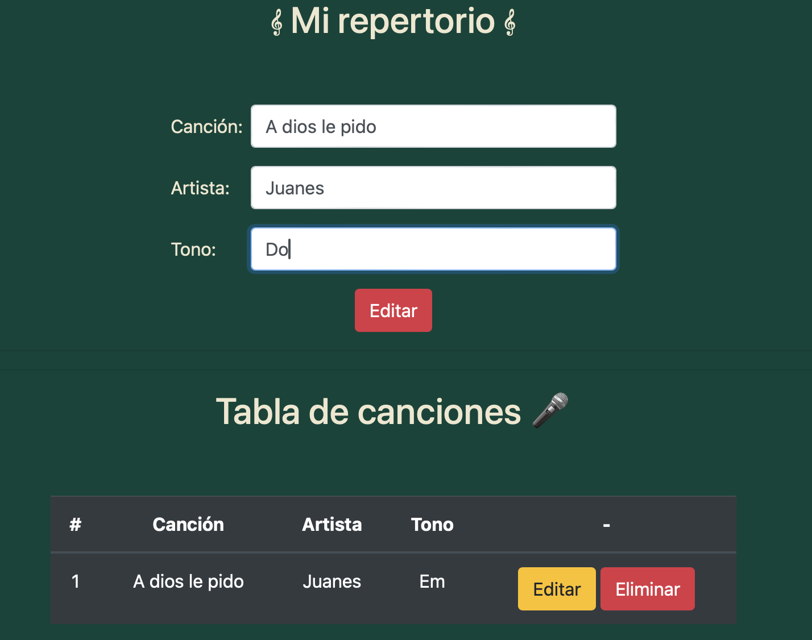
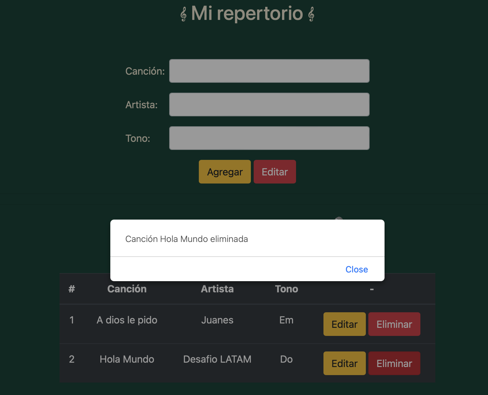

# Desafío - Mi repertorio

Descripción:
La escuela de música “E-Sueño” está motivando a sus estudiantes de canto a presentarse en vivo y se puso en contacto con el restaurante del sector para utilizar su tarima e iniciar un calendario de presentaciones. Para conocer y gestionar las canciones que cantarán sus estudiantes, la escuela contrató a un desarrollador freelance para la creación de una aplicación tipo CRUD.

